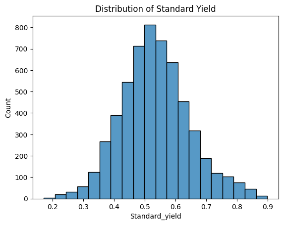
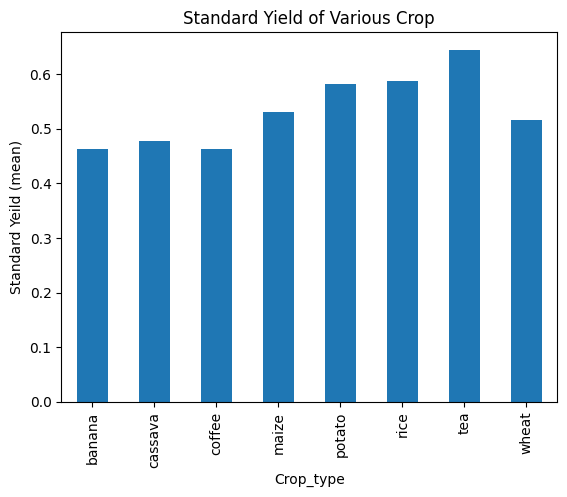
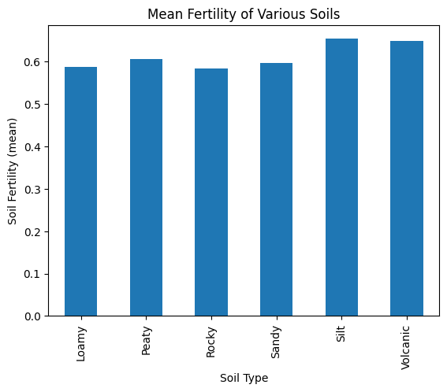
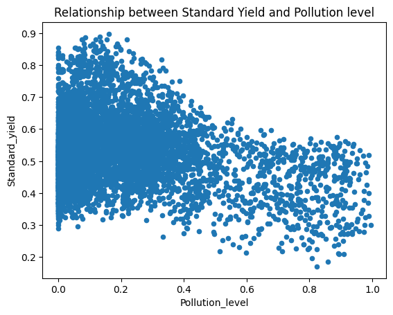
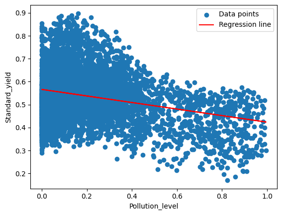
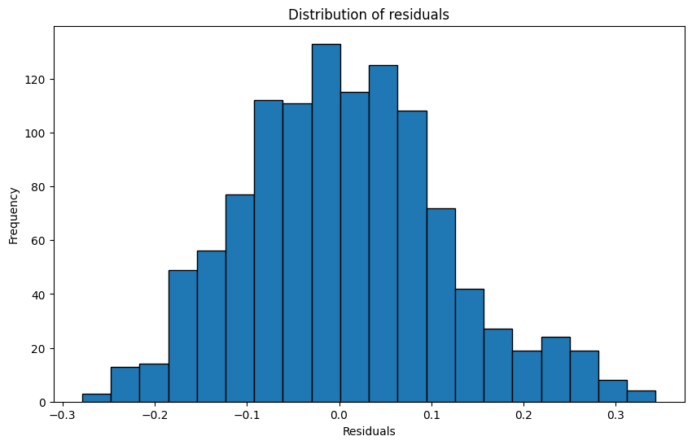
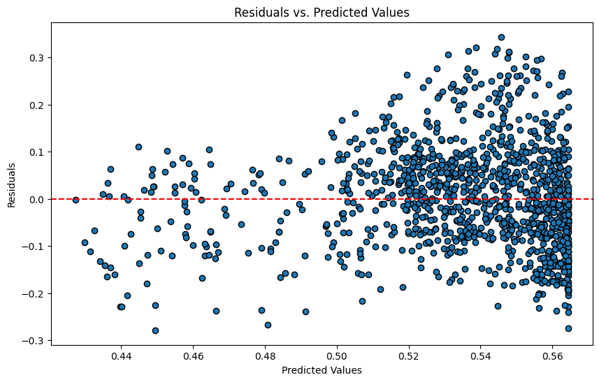

# **UNDERSTANDING MAJI NDOGO'S AGRICULTURE PROBLEM**  
**_Python Data Analysis & Regression Modeling_**  


## **INTRODUCTION**  
Maji Ndogo, an **imaginary country**, is facing agricultural challenges due to **geographic, weather, and soil conditions**. This project aims to **analyze farming data**, understand key factors influencing **crop yield**, and develop a **predictive model** to assist in optimizing farm production.  

By leveraging **data analysis and regression modeling**, we can **recommend best farming practices** for different regions and conditions.  

---

## **PROBLEM STATEMENT**  
Farmers in Maji Ndogo need insights into **where and what to plant** based on environmental conditions.  
Key challenges include:  
- Identifying the **best locations for specific crops** based on soil, weather, and geography.  
- Understanding the relationship between **environmental factors and crop yield**.  
- Predicting **standardized crop yield** using **linear regression**.  

---

## **SKILL DEMONSTRATION**  
- **Data Extraction & Cleaning**: Importing from **SQLite database** and merging multiple tables.  
- **Exploratory Data Analysis (EDA)**: Identifying trends and relationships.  
- **Feature Engineering**: Creating meaningful variables for prediction.  
- **Machine Learning (Regression)**: Building a **Simple Linear Regression Model**.  
- **Data Visualization**: Using **matplotlib & seaborn** to analyze trends.  

---

## **DATA SOURCING**  
The dataset is stored in an **SQLite database** and consists of multiple tables:  

### **1. Geographic Features**  
- **Field_ID** – Unique identifier for each field.  
- **Elevation, Latitude, Longitude** – Geospatial data.  
- **Slope** – Measures land inclination.  

### **2. Weather Features**  
- **Rainfall (mm)**  
- **Minimum & Maximum Temperature (°C)**  
- **Average Temperature (°C)**  

### **3. Soil & Crop Features**  
- **Soil Fertility Index (0-1)**  
- **Soil Type & pH Level**  
- **Chosen Crop & Standardized Yield**  

### **4. Farm Management Features**  
- **Pollution Level (0-1)**  
- **Plot Size (Hectares)**  
- **Annual Yield**  

---

## **EXPLORATORY DATA ANALYSIS (EDA)**  
EDA was performed to explore **how environmental factors influence crop yield**.  



### **1. Data Overview**  
- Extracted **multiple tables from SQLite** and merged into a single **pandas DataFrame**.  
- Checked for **missing values** and handled inconsistencies.  

### **2. Feature Distributions**  
- **Histograms & Box Plots** for rainfall, temperature, soil fertility, and pollution levels.  
- **Scatter Plots** to visualize relationships between yield and environmental factors.  

Crop Yield                 |         Soil Fertility
|:------------------------:|:-----------------------:|
       |  

### **3. Correlation Analysis**  
- **Heatmap** showing relationships between rainfall, temperature, soil type, and crop yield.  
- **Pairplot** to analyze interactions between multiple variables.  

### **4. Key Insights**  
- **Temperature and Rainfall** are major predictors of crop yield.  
- **Soil Fertility** significantly influences standardized yield.  
- **Some locations are more suitable for specific crops** due to their environmental conditions.  

  
  

---

## **MODELLING**  
To **predict standardized crop yield**, we implemented **Simple Linear Regression**.  

### **1. Model Implementation**  
- **Independent Variable (`X`)**: Selected **environmental factors** (e.g., temperature, rainfall, soil fertility).  
- **Dependent Variable (`y`)**: Standardized crop yield.  
- **Model Used**: `sklearn.linear_model.LinearRegression`  
- **Training & Testing**: Dataset split into **80% training, 20% testing**.  



### **2. Model Evaluation**  
- **Mean Absolute Error (MAE)** – Measures average prediction error.  
- **Mean Squared Error (MSE)** – Penalizes large errors.  
- **R² Score** – Explains variance in crop yield due to environmental factors.  

---

## **ANALYSIS & VISUALIZATION**  
- **Scatter Plot:** Relationship between rainfall, temperature, and crop yield.  
- **Correlation Heatmap:** Identifies strongest predictors for crop yield.  
- **Regression Line Plot:** Shows **linear relationship** between environmental factors and yield.  
- **Residual Plot:** Evaluates model accuracy by checking prediction errors.




---

## **CONCLUSION**  
1. **Rainfall & Temperature** are the strongest predictors of crop yield.  
2. **Soil Fertility** has a significant impact on **standardized yield**.  
3. The **Simple Linear Regression model successfully predicts crop yield trends**.  
4. Future improvements should include **multiple regression models** for better accuracy.  

---

## **HOW TO RUN THE PROJECT**  
### **1. Prerequisites**  
Ensure you have Python installed along with the required libraries:  
```bash
pip install numpy pandas sqlite3 seaborn scikit-learn matplotlib
```
### **2. Clone the Repository**  
```bash
git clone https://github.com/yourusername/Maji-Ndogo-Agriculture.git
cd Maji-Ndogo-Agriculture
```
### **3. Run the Jupyter Notebooks**  
```bash
jupyter notebook Code_challenge_Integrated_Project_P1_model_solution.ipynb
jupyter notebook Linear_regression_Code_challenge_model_solution.ipynb
```
